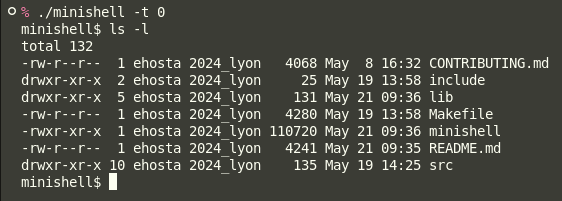
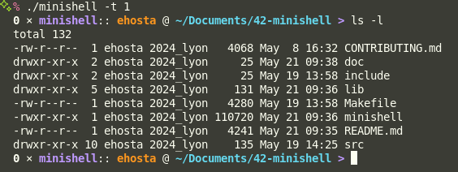
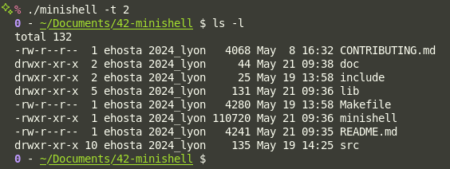
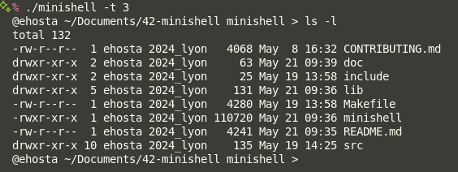

<h1 align="center">42-minishell</h1>

<h3 align="center">A reproduction of the bash environment with its command interpretation.</h3>

| Project | minishell                  |
|:--------|---------------------------:|
| Locked  | 2025-03-21 18:29 CET:+0100 |
| Closed  | 2025-05-19 14:31 CET:+0100 |
| Grade   | 101%                       |
| Retries | 0                          |


> "The existence of shells is linked to the very existence of IT.
> 
> At the time, all developers agreed that *communicating with a computer using aligned 1/0 switches was seriously irritating*.
> 
> It was only logical that they came up with the idea of creating a software to communicate with a computer using interactive lines of commands in a language somewhat close to the human language.
> 
> Thanks to Minishell, you’ll be able to travel through time and come back to problems people faced when Windows didn’t exist."

# Features

## 🖥️ Prompt Features

- **Color Themes**: The shell supports **4 distinct color themes**, allowing users to customize their interface. You can select a theme at launch using the following syntax:
```bash
./minishell -t <n>
```

Replace `<n>` with a number from `0` to `3` to activate the desired theme.

| Theme ID                                    | Capture                     |
|:--------------------------------------------|----------------------------:|
| Theme 1 (`./minishell -t 0`, `./minishell`) |  |
| Theme 2 (`./minishell -t 1`)                |  |
| Theme 3 (`./minishell -t 2`)                |  |
| Theme 4 (`./minishell -t 3`)                |  |

* **Command History**: A persistent in-session **command history** is available, enabling users to recall and reuse previously typed commands efficiently.

---

## 🧠 Command Interpretation

* **Robust Parsing**: The shell includes a custom-built parser capable of handling:

  * **Quotes** (single and double) for grouping or escaping
  * **Variable expansion** (e.g., `$HOME`, `$?`, etc.)
  * **Pipes** (`|`) for command chaining
  * **Redirections** (`>`, `>>`, `<`) for input/output control

* **Heredoc Support**: Implements a **basic heredoc** mechanism (`<<`) with a single custom delimiter, allowing multi-line user input to be passed to commands.

---

## ⚙️ Built-in Commands

The shell comes with **8 built-in commands**, covering a wide range of basic shell functionality:

* `echo`
* `exit`
* `export`
* `cd`
* `unset`
* `pwd`
* `env`

Each built-in replicates the behavior of its Bash counterpart as closely as possible, with support for common flags and edge cases where relevant.

---

## 🚀 Command Execution

* **Executable Resolution**:

  * Commands are executed whether they are found via the `PATH` environment variable, or specified using **absolute** or **relative paths**.
  * The shell also includes **fallback execution paths** in case the environment variables are unavailable, ensuring maximum resilience.

* **Error and Redirection Handling**:

  * Execution errors (such as permission denied, command not found, etc.) are **gracefully handled** with descriptive messages.
  * **Redirection operations** are fully supported and are processed in the correct order and scope, even in the presence of complex command chains.

---

## 🧩 System Management

- **Signal Handling**:
  - The shell includes a **custom signal handling system** that manages interrupts (`SIGINT`), quits (`SIGQUIT`), and end-of-file (`EOF`) appropriately depending on the current execution context.
  - For example, `Ctrl+C` interrupts a running command without exiting the shell, while signal behavior differs between heredocs, child processes, and idle prompt.

- **Error Management**:
  - Errors are **systematically tracked and categorized**, allowing for informative and context-aware error messages.
  - This includes parsing failures, execution errors, file descriptor issues, and environment-related exceptions.

- **Memory Management**:
  - All memory allocations are **manually managed**, with rigorous cleanup procedures in place to avoid leaks.
  - Resources are freed after each command cycle, and temporary buffers or structures (e.g. token lists, AST nodes, heredoc buffers) are correctly released.

- **Output Management**:
  - Standard output and error streams are **explicitly managed**, ensuring clean and predictable redirection behaviors.
  - When executing pipelines or handling redirections, **file descriptors are duplicated and restored** as needed to maintain shell integrity and prevent unintended side effects.

- **Environment Variable Management**:
  - The shell maintains a **fully functional and dynamic environment variable system**.
  - Variables can be created, modified, and deleted at runtime via built-in commands such as `export` and `unset`.
  - Internal operations (like `$VARIABLE` expansion, command substitution, etc.) rely on a custom environment list, independent from the system's, ensuring predictable behavior even without an inherited environment.

---

This introduction has been generated with AI.

# Group / students on the project

- [@ehosta](https://profile.intra.42.fr/users/ehosta) ([GitHub Profile](https://github.com/panda2742))
- [@abonifac](https://profile.intra.42.fr/users/abonifac) ([GitHub Profile](https://github.com/AlexBonifacio))
